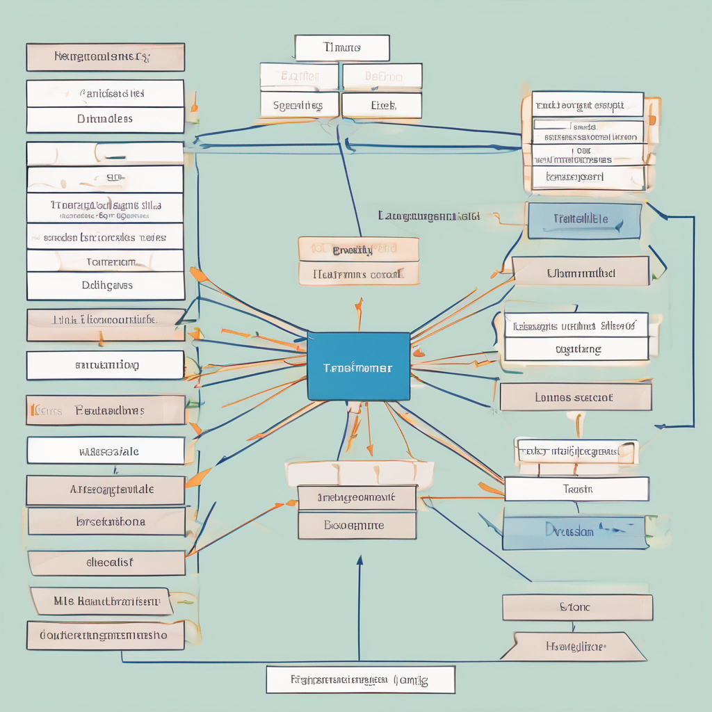

Generative AI is all the rage, and for good reason, but actually implementing an 
inference pipeline has many challenges, not the least of which is getting and serving
a model to our peers.

We want to build something like: 

Let's build a simple inference API in a Jupyter notebook to help get us started.

```python
import transformers
import fastapi

@app
def route("/"):
    print("Hello World")
```